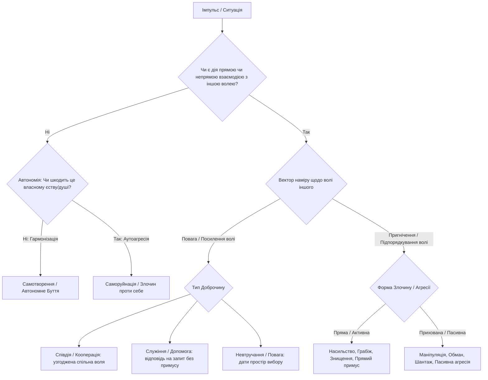
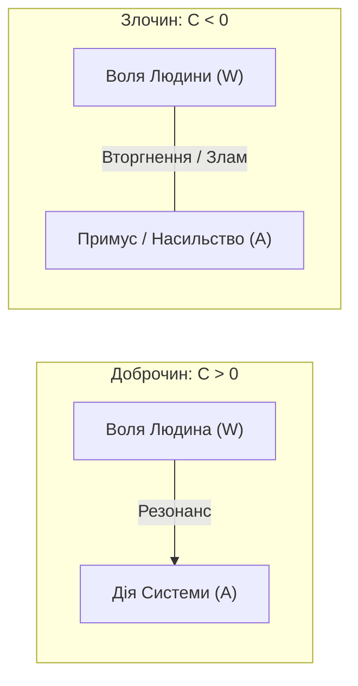
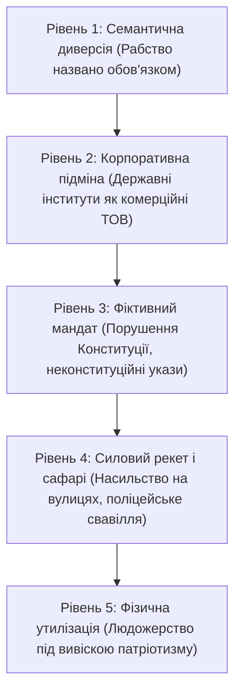

[← Назад: 08. Гуманітарні Науки Точні](./08-exact-humanities.md) | [Головна (Зміст)](./README.md) | [10. W-Протокол: Алгоритм Захисту Волі →](./10-w-protocol.md)

---

# 09: Формула Волі: Дискретна Модель, Доброчин і Злочин

> - **Розділ:** Математична декомпозиція волі, наміру та дії. Аксіома Цілого, статус легітимності та автоімунний колапс систем.
> - **Зв'язок із моделлю:** Формалізація внутрішнього стану Волі ($S_{int}^{Will} = W$) як векторного оператора взаємодії та етичного виміру буття.

---

## 1. Наукове та Філософське Підґрунтя

Моделювання поведінки людини здійснюється через призму **дискретної декомпозиції волі, наміру та дії**. Ця концепція синтезує кілька фундаментальних світоглядних і наукових шкіл:

1. **Принцип ненападу (Non-Aggression Principle, NAP) та природні права (Джон Локк, Іммануїл Кант):**
   - Злочин визначається виключно через **порушення (пригнічення) суверенної волі** іншої істоти (життя, свободи, вибору чи гідності).
   - Кантівський категоричний імператив стверджує: *«Ніколи не стався до іншого лише як до засобу, але завжди як до мети»*. Коли чиюсь волю ламають або ігнорують — істоту редукують до знаряддя чи ресурсу.
2. **Етимологія та онтологія: Доброчин vs Злочин:**
   - Корінь **«чин»** — це дія, творення, порядок, ранг, реалізація наміру.
   - **Доброчин** — дія в гармонії, злагоді, що підсилює або шанує суверенну волю.
   - **Злочин** — дія на розрив єдності, вторгнення у чужий суверенітет (узурпація волі).
3. **Трансакційний аналіз та Теорія ігор:**
   - **Ігри з нульовою сумою** (Zero-sum games): вигода одного досягається пригніченням або пограбуванням іншого $\to$ Злочин / Агресія / Експлуатація.
   - **Ігри з додатною сумою** (Non-zero-sum / Win-Win): кооперація, за якої суверенні волі резонують і підсилюють одна одну $\to$ Доброчин / Синергія.
4. **Біоцентрична етика (Альберт Швейцер, «Повага до життя»):**
   - *«Я є життя, яке хоче жити, серед життя, яке хоче жити»*. Позбавлення життя чи пригнічення без вільної згоди створіння є абсолютним злочином проти волі буття.

---

## 2. Дискретна Бінарна Модель Поведінки (Дерево Дій)

Поведінка будь-якого суб'єкта формалізується як дискретне бінарне дерево вибору (кінцевий автомат), де кожен крок зводиться до перевірки стану волі:

### Дискретні Координати Стану Суб'єкта

1. **Координата Єдності (Джерело наміру):**
   - `[0]` **Страх / Відокремленість** — світ сприймається як ворожий ресурс $\to$ прагнення до контролю, узурпації та насилля.
   - `[1]` **Любов / Єдність** — усвідомлення цілісності Всесвіту $\to$ бережливе ставлення до чужого суверенітету.
2. **Координата Згоди (Consent / Суверенітет):**
   - `[0]` **Узурпація** — дія здійснюється всупереч, без усвідомленої згоди, або через обман і маніпуляцію.
   - `[1]` **Згода / Резонанс** — дія взаємно узгоджена, суверенні кордони непорушні.
3. **Координата Балансу (Енергетичний підсумок):**
   - `[+]` **Синтропія (Творення)** — після взаємодії міри життя, ресурсу, свідомості чи свободи у просторі побільшало.
   - `[-]` **Ентропія (Паразитизм)** — дія спалила чужий ресурс заради егоїстичного виживання штучної системи чи агресора.

---

## 3. Аксіома Цілого: «Воля Цілого $\equiv$ Воля Кожного»

> ### Фундаментальна Аксіома:
> Якщо система стверджує, що діє «в інтересах цілого (народу, держави, нації)», але для цього **пригнічує, ламає або утилізує волю хоча б однієї суверенної живої людини без її особистої згоди** — це математична та логічна підміна понять.
>
> **Шанувати волю цілого — означає шанувати волю кожного.**
>
> Ціле не є абстрактним ідолом (Левіафаном). Здоровий біологічний організм не знищує власні живі клітини заради «абстрактного блага тіла». Організм, який пожирає власні клітини — хворіє на рак або перебуває у стані автоімунного збою.

---

## 4. Математична Формула: Злочин vs Доброчин

Нехай $W_i$ — вектор суверенної волі (**Will**) суб'єкта $i$, а $A_{S \to i}$ — вектор дії суб'єкта (або системи) $S$ щодо суб'єкта $i$:

$$C(S, i) = A_{S \to i} \cdot W_i$$

де скалярний добуток визначає етичну якість чину:

- **Доброчин ($C > 0$):** Дія співнаправлена з вільною волею суб'єкта або здійснена на його прямий щирий запит ($A_{S \to i} \parallel W_i$). Синергія, примноження життя і свободи.
- **Суверенний нейтралітет ($C = 0$):** Дія не перетинає меж суверенітету ($A_{S \to i} \perp W_i$ або $A = 0$). Повага до вільного простору буття.
- **Злочин ($C < 0$):** Дія спрямована проти волі, ламає, уярмлює або нищить суб'єкта ($A_{S \to i} \cdot W_i < 0$). **Будь-який примус є злочином проти Природного Права.**

---

## 5. Формула Легітимності Системи та Держави

Будь-яка публічна влада, інститут чи представництво $P$ у природному правовому полі може бути виключно сумою добровільно та явно делегованої волі:

$$P = \sum_{k=1}^{N} \delta_k \cdot W_k$$

де $\delta_k \in \{0, 1\}$ — явний, усвідомлений, невідкликаний акт довіри/згоди кожної конкретної живої людини $k$.

- **Якщо $\delta_k = 0$** (людина не делегувала повноважень, відкликала згоду, або посадовець порушив присягу):
  $$A_{S \to k} \neq 0 \implies \mathbf{Узурпація\ та\ Системний\ Тероризм}$$
- **Інверсія присяги:** Посадовець присягає народові (служити і захищати волю кожного $W_k$). Вимога системи до народу «покласти життя за чиновницький апарат» — це математична інверсія знака вектора:
  $$\vec{W}_{\text{народу}} \longleftrightarrow -\vec{W}_{\text{паразита}}$$

---

## 6. Рівні Системного Пригнічення та Матриця Розпізнавання

### Матриця: «Свій / Ворог / Паразит»

| Суб'єкт / Дія | Вектор дії щодо твоєї волі $W_i$ | Статус за Природним Правом |
| :--- | :--- | :--- |
| **Свій (Людина, Побратим)** | $A \cdot W_i > 0$ (Діє за згодою, підсилює життя) | **Доброчинець** |
| **Нейтральний Суверен** | $A \cdot W_i = 0$ (Не порушує суверенні кордони) | **Суверен** |
| **Паразит / Шахрай** | $A \cdot W_i < 0$ (Маніпуляція, економічний визиск) | **Прихований злочинець** |
| **Людожер / Узурпатор** | $A \cdot W_i \ll 0$ (Силове позбавлення волі/життя) | **Прямий злочинець / Окупант** |

---

## 7. Феномен Автоімунного Самознищення

Чому людство тисячоліттями рухається замкненим колом війн і тираній:

1. **Ілюзія «Знищити верхівку»:** Знищення одного тирана зі збереженням **алгоритму примусу** неминуче породжує нового тирана. Зміна прапорів і декорацій не змінює математику гри з нульовою сумою.
2. **Корпоративний неофеодалізм:** Інститути монополії на насильство тихо реєструються як суб'єкти комерційного права, головна мета яких — збереження апарату й експлуатація людського ресурсу.
3. **Автоімунний колапс:** Коли державна машина розпочинає відкрите полювання на власне цивільне населення, це еквівалентно фатальному збою імунітету: **імунна система нищить власні тканини. Фінал автоімунного процесу — неминуча біологічна та системна загибель усього організму.**
