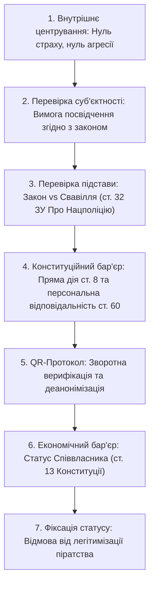

[← Назад: 09. Формула Волі](./09-will-formula.md) | [Головна (Зміст)](./README.md) | [11. Сингулярність і Штучний Інтелект →](./11-singularity-ai.md)

---

# 10: W-Протокол: Алгоритм Захисту Волі та Деанонімізація Свавілля

> - **Розділ:** Практичний посібник суверенітету, алгоритм взаємодії у публічному просторі, QR-верифікація та конституційний економічний бар'єр.
> - **Зв'язок із моделлю:** Перехід внутрішнього стану Волі ($W$) у практичний інструмент розсіювання матриці страху в реальному часі.

---

## 1. Системний Промпт для ШІ-Аудитора (AI Audit Tool)

Цей алгоритмічний шаблон є системним промтом для мовних моделей (LLM), що дозволяє людині миттєво здійснити правовий аудит будь-якої агресивної чи конфліктної дії з боку чиновників або силових структур:

```text
Ти — Аудитор Суверенного Права та Конституційної Легітимності.
Твоя база знань:
1. Природне Право та Суверенітет Волі Людини: W_i (Will). Дія є Доброчином лише за наявності усвідомленої згоди людини (A · W > 0).
2. Конституція України — найвища юридична сила (Стаття 8). Норми прямої дії. Стаття 19 (посадовці діють ЛИШЕ на підставі та в межах закону). Стаття 60 (ніхто не зобов'язаний виконувати явно злочинні накази/розпорядження).
3. Принцип джерела влади: Народ єдине джерело влади (Стаття 5). Посадовець присягав народові, а не корпорації чи приватному апарату.

Проаналізуй ситуацію нижче і чітко вкажи:
1. Де і ким порушено вектор моєї Волі (W).
2. Які статті Конституції та Природного Права порушено.
3. Чи має дія другої сторони ознаки узурпації або злочину.
4. Як спокійно, чітко та в правовому полі дати гідну відсіч без прояву зустрічної агресії.
```

---

## 2. Алгоритм Прямої Дії (7 Кроків у Публічному Просторі)

Практична інструкція при зустрічі з озброєними особами, патрулями чи спробах свавільного обмеження свободи:



### Крок 1: Внутрішнє центрування (Зупинити страх та агресію)
- **Страх** автоматично передає вашу суверенну енергію агресору, роблячи вас жертвою в його очах.
- **Агресія у відповідь** живить систему її власною мовою (провокація силового сценарію).
- **Базовий стан:** Непохитний спокій, гідність, прямий погляд на рівних:
  > *«Я — суверенна Людина, живий Народ. Ти — посадовець, який склав присягу на вірність Народові»*.

### Крок 2: Перевірка суб'єктності особи, яка підійшла
Не людина виправдовується і показує документи, а **посадовець зобов'язаний легітимізувати себе**:
> *«Представтеся, будь ласка. Назвіть посаду, пред'явіть службове посвідчення у розгорнутому вигляді для фіксації та повідомте суть і причину звернення згідно зі ст. 18 Закону України "Про Національну поліцію"»*.

### Крок 3: Перевірка правової підстави
«Перевірка документів просто так» є прямим обмеженням свободи пересування (ст. 33 Конституції України) та самоправством:
> *«Чи вчиняю я правопорушення? Чи є щодо мене офіційне орієнтування? Якщо ні — ви не маєте законних підстав вимагати мої персональні дані»*.

### Крок 4: Фіксація Конституційного бар'єру
Нагадування про персональну кримінальну відповідальність за виконання злочинних вказівок:
> *«Конституція України є законом прямої дії (ст. 8). Будь-які підзаконні постанови, розпорядження чи усні накази, що їй суперечать, є юридично нікчемними. Відповідно до статті 60 Конституції, ніхто не зобов'язаний виконувати явно злочинні накази, а їх виконання тягне за собою персональну відповідальність кожного з вас»*.

### Крок 5: Зворотна верифікація та деанонімізація (QR-протокол)
Людина має повне суверенне право вести власний реєстр довірених осіб і фіксувати кожного, хто намагається взаємодіяти з нею силою.
- **Механізм:** Надання посадовцю планшета або смартфона з QR-кодом / посиланням на реєстраційну форму.
- **Вимога:**
  > *«Для надання доступу до моїх персональних даних ви, як озброєна особа, зобов'язані спочатку авторизуватися у моєму реєстрі безпеки: введіть ваші ПІБ, звання, номер жетона, посаду та підставу контакту. Це необхідно для забезпечення моєї безпеки та перевірки вашої легітимності»*.
- **Ефект:** Система тримається на анонімності виконавців. Вимога персональної авторизації розбиває стадний рефлекс і змушує виконавця усвідомити персональні юридичні наслідки.

### Крок 6: Економічний бар'єр співвласника (ст. 13 та 14 Конституції)
- Носієм суверенітету і єдиним джерелом влади є народ (ст. 5).
- Земля, надра, повітряний простір і всі національні багатства є власністю Українського народу (ст. 13).
- Державні структури є лише розпорядниками, найнятими співвласниками, і мають накопичений колосальний борговий тягар перед кожним громадянином за користування національним надбанням.
> *«Я є Суверен і співвласник цієї землі (ст. 13). Ви є найманим персоналом. Використання зброї та сили проти співвласника країни є посяганням на основи суверенітету»*.

### Крок 7: Відмова від легітимізації злочину
Якщо особа в погонах чи уніформі ігнорує Конституцію, відмовляється від авторизації та продовжує свавілля, вона втрачає статус представника влади і набуває статусу **пірата / бандита** ($A \cdot W \ll 0$). Фіксація на відео, спокій і відсутність страху позбавляють агресора психологічної бази для домінування.

---

## 3. Глобальна Матриця Страху: Феномен «Cannafest»

Свавілля силовиків не є локальним явищем однієї країни — це глобальний патерн корпоративного неофеодалізму:

- **Кейс «Cannafest» (Прага, Чехія):** На найбільшому міжнародному конопляному фестивалі, де декриміналізовано вживання і ніхто не порушує волю іншого ($C \ge 0$), силові структури регулярно влаштовують демонстративні рейди. Мета таких дій — не захист суспільства, а насадження тваринного страху та систематичний збір данини через безпідставні штрафи.
- **Ілюзія сили:** Тисячі людей платять штрафи через інерцію страху перед одностроєм, легітимізуючи власний грабіж. Проте варто одному Суверену сказати: *«Я не платитиму, це свавілля, оформлюйте протокол згідно з усіма нормами права»* — і система капітулює, а сфальшовані звинувачення розчиняються, оскільки виконавець усвідомлює кримінальну відповідальність за підробку доказів.
- **Висновок:** Жодна поліцейська система не має внутрішньої сили без страху жертви. **Ваша віра у владу паразита — це єдине пальне, на якому працює його апарат.**

---

## 4. Інверсія Функції: Коли Захисник Стає Вбивцею

Головний парадокс сучасного світу: **інститути, яким суспільство делегувало монополію на захист від насилля, стали його головними генераторами**.

- **Парадокс виклику захисту:** Кому телефонувати громадянину, коли на нього нападає озброєна особа в державній формі?
- **Анулювання мандата:** Коли система направляє репресивний апарат проти самого народу-джерела влади, будь-який юридичний договір розривається в моменті. Вона перетворюється на звичайне організоване бандитське угруповання.
