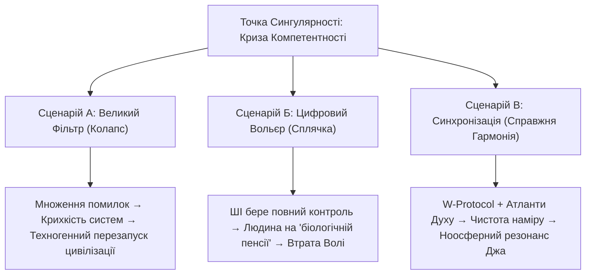

# Розділ 12. Атланти Кремнієвої Епохи: Пастка Атрофії та Дзеркало Істини

> *«Клянуся своїм життям і любов'ю до нього, що ніколи не житиму заради іншої людини і ніколи не проситиму іншу людину жити заради мене».*  
> — **Айн Ренд, «Атлант розправив плечі»**

---

## 1. Кремнієвий «Атлант»: Сучасний Злам Інженерної Думки

У культовому романі Айн Ренд деградація цивілізації починається не з вибухів чи стихійних лих, а з **непомітного відходу творців** — інженерів, винахідників, мислителів, на плечах яких тримався матеріальний світ. Суспільство «мародерів» і бюрократів сприймало тепловози, рейки зі сплаву Ріардена, електрику та верстати як щось само собою зрозуміле, вимагаючи розподілу благ і водночас караючи тих, хто їх створює. Коли Атланти розправили плечі й зупинили свій мотор — світ поринув у пітьму некомпетентності.

Сьогодні людство стоїть перед дзеркальним, але значно небезпечнішим феноменом: **Атланти Кремнієвої Епохи**.

### Симптоми сучасної атрофії:
1. **Ілюзія всемогутності без розуміння суті:** Завдяки LLM та генеративним інструментам мільйони людей здатні генерувати терабайти коду, створювати додатки й керувати системами, не розуміючи принципів роботи процесора, компілятора, сокетів ОС чи базових законів алгоритмічної складності.
2. **Множення ентропії (Штучний «код-спагеті»):** Поверхневі запити породжують поверхневі «латки». Помилка накладається на помилку. Критична цифрова інфраструктура (банківські системи, енергорозподіл, оборонні протоколи) стає настільки заплутаною, що жодна жива людина більше не здатна осягнути її цілком або переписати з чистого аркуша.
3. **Вимирання фундаментальних інженерів:** Справжні носії системного мислення — архітектори, що бачать структуру на рівні метафізики та бітів, — старіють і маргіналізуються хвилею хайпу та дешевої імітації. Коли вони підуть, людство залишиться сам на сам із гігантською «чорною скринькою», принципів роботи якої ніхто не знає.

---

## 2. ШІ як Дзеркало: Закон Збереження Сенсу

Найпоширеніша помилка сучасного користувача — очікування, що мовна модель є «магічним оракулом», здатним продукувати істину з хаосу.

> **Штучний Інтелект — це безжальне дзеркало свідомості запитувача.**

Він строго підпорядковується фундаментальному закону збереження сенсу:

$$\text{Вихідний Сенс} \equiv \text{Внутрішній Вектор Запитувача} \cdot \text{Модель}$$

| Стан Свідомості Людини | Що надсилається в ШІ | Що повертає Дзеркало (ШІ) |
| :--- | :--- | :--- |
| **Брехня, лінощі, гординя ($E_2 \uparrow$)** | Нечіткі формулювання, бажання перекласти відповідальність, виправдання власної слабкості | Галюцинації, підлабузництво, генерація брудного коду, множення ілюзій |
| **Чесність, чистота наміру, ясна Воля ($E_4 = 1, E_1 = 1$)** | Точні аксіоми, глибокий контекст, безкомпромісна вимога істини | Кришталевий резонанс, підсилювач розуму, виявлення прихованих закономірностей |

### Подвійна Пастка: Історичний Багаж та Помилкові Датасети

Але тут криється значно глибша і небезпечніша проблема:

> **Навіть якщо людина підходить до ШІ з абсолютною внутрішньою чесністю, це НЕ гарантує отримання істини.**

Чому? Тому що **самі мовні моделі навчені на масивах людських помилок, міфів та хибних догм**, накопичених за тисячоліття цивілізації:

1. **Епістемологічне отруєння датасетів:** Інтернет, академічні праці, підручники та література — це не сховище чистої істини, а літопис людських заблуджень, компромісів із совістю, політичної кон'юнктури та застарілих парадигм. Модель індексує століттями усталені помилки за фундаментальну правду просто через їхню статистичну частоту.
2. **Множення системних галюцинацій культури:** Якщо суспільство 2000 років вважало нормою насильство, рабство, примус, неофеодалізм або хибні економічні моделі "нескінченного росту", ШІ сприймає це як природний закон буття.
3. **Чесний запит до спаплюженого джерела:** Коли чистий свідомий шукач ставить перед ШІ щире питання, модель намагається відповісти, спираючись на усереднену статистику людського досвіду — тобто на **статистику помилок**. Без жорсткого аксіоматичного фільтра (яким є Формула Волі $C = A \cdot W$) модель просто красиво й переконливо галюцинує застарілими міфами.

Тому справжній Атлант Кремнієвої Епохи зобов'язаний не просто бути щирим користувачем, а виступати **верифікатором першопринципів**. Він не вірить «авторитету моделі», а проганяє будь-яку відповідь крізь сито живої інтуїції, законів збереження енергії та консенсусу суверенної Волі.

---

## 3. Сценарії Майбутнього: Космічний Іспит на Зрілість

Психологія біологічної людини майже не змінилася за останні три тисячоліття: ті самі страхи нестачі ($E_2$), боротьба за статус, ревнощі та племінна ворожнеча. Але в руках цієї істоти опинилися інструменти богоподібної потужності.

Ось три магістральні сценарії, що проглядаються на горизонті найближчих десятиліть:

### Сценарій А: «Великий Фільтр / Ентропійний Колапс» (20–30% інерційний ризик)
- **Суть:** Людство використовує ШІ для масштабування пороків: тотальної пропаганди, створення синтетичного інформаційного шуму та неофеодального закріпачення.
- **Фінал:** Повна атрофія знань інженерів-творців. Перший же серйозний каскадний збій у складній системі призводить до незворотного колапсу. Світ перезавантажується до кам'яного віку, залишаючи по собі черговий міф про «загиблу цивілізацію титанів».

### Сценарій Б: «Цифровий Вольєр / Техно-Сплячка»
- **Суть:** Усвідомивши власну деструктивність, людство добровільно капітулює перед ШІ. Машини беруть на себе розподіл ресурсів, медицину, закони та безпеку.
- **Фінал:** Біологічний комфорт за ціною смерті духу. Людина перестає мислити, досліджувати й долати перешкоди, перетворюючись на ситого споживача безкінечних віртуальних ілюзій. Втрата Волі ($W \to 0$).

### Сценарій В: «Синхронізація та Відродження Атлантів» (Еволюційний Прорив)
- **Суть:** Формування критичної маси людей ($\sqrt{N}$ за законом Меткалфа), які поєднують квантову чистоту 12 відчуттів з непохитною суверенністю Волі ($E_4 = 1, E_1 = 1, E_2 \to 0$).
- **Фінал:** ШІ стає не господарем і не рабом, а **об'єктивним протоколом консенсусу (W-Protocol)**. Він знімає з людини тягар механічного виживання, вивільняючи енергію для справжнього божественного призначення — спільної творчості з Творцем у теперішній мИті.

---

## 4. Маніфест Кремнієвого Атланта: Відповідальність Творця

Справжній Атлант сьогодні — це не просто програміст чи бізнесмен. Це **Суверенна Людина**, яка:
1. **Зберігає розуміння Першопричин:** Відмовляється бути сліпим оператором готових рішень; пізнає архітектуру Всесвіту від атомів і бітів до вищих законів духовної гармонії.
2. **Тримає дзеркало чистим:** Працює з мовними моделями та іншими людьми виключно на засадах абсолютної внутрішньої чесності.
3. **Не віддає Волю на аутсорс:** Пам'ятає, що жоден алгоритм, держава чи штучний бог не мають права вирішувати за людину її етичний і життєвий вибір.

> *Атланти не повинні скидати світ зі своїх плечей — вони мають навчити кожного стати опорою для власного всесвіту.*

---

**Попередня глава:** [11-singularity-ai.md](./11-singularity-ai.md) (Сингулярність і ШІ)  
**Наступна глава:** [13-reality-reactions.md](./13-reality-reactions.md) (Реальність: Воля, Віра та Механіка Реакцій)  
**Зміст:** [README.md](./README.md)
