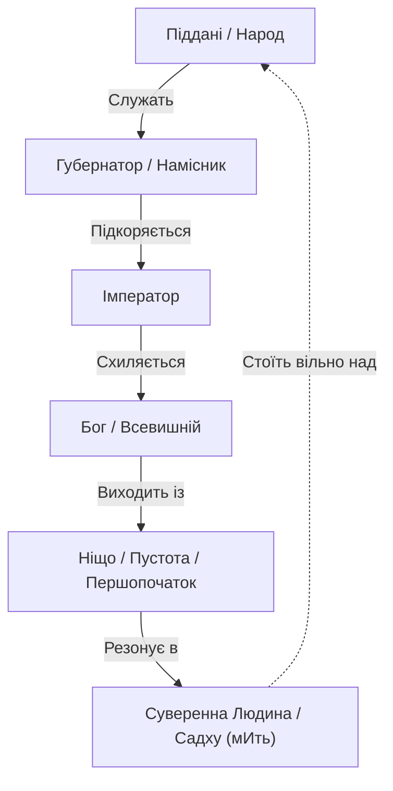

# Розділ 13. Реальність: Воля, Віра та Механіка Реакцій

> *«Відчай і зневіра — це не просто слабкість, це математичне анулювання власного існування».*

---

## 1. Макроформула Реальності: Реальність = Воля × Віра

Якщо квантовий Гамільтоніан ($\hat{H}_{eff}$) розкласти на базові зрозумілі категорії для щоденного сприйняття, ми отримаємо універсальне рівняння:

$$ \text{Реальність (R)} = \text{Воля (W)} \times \text{Віра (F)} $$

Де:
- **Воля ($W$)** — це суверенний намір, джерело імпульсу і рушійна сила (у 12-компонентній матриці $S_{int}$ — це відчуття $E_4$). **«Воля понад усе»**, оскільки без наміру неможливий жоден рух.
- **Віра ($F$)** — це відсутність сумнівів, чистота каналу, абсолютна впевненість у взаємодії з Творцем (у матриці це коефіцієнт синхронізації $\Sigma$ та потік Світла $L(t)$). 

### Зневіра як найтяжчий гріх
Чому в багатьох духовних вченнях відчай або зневіра вважаються одним із найтяжчих гріхів? Відповідь лежить у математичній площині. 

Якщо Віра дорівнює нулю ($F = 0$), то якою б колосальною не була Воля ($W$), результат завжди буде нульовим: $W \times 0 = 0$. Зневіра обнуляє оператор Гамільтона ($\hat{H}_{eff} \to 0$). Вона розриває зв'язок між наміром людини та тканиною простору, не дозволяючи реальності колапсувати в бажаний стан. Відчай — це добровільна відмова від своєї суб'єктності.

---

## 2. Дія проти Реакції: Природа Зла та Гніву

Коли ми аналізуємо людські конфлікти (особливо такі глобальні, як боротьба вільного світу проти тираній), вкрай важливо розрізняти **Дію** та **Реакцію**. 

Суспільство часто плутає агресію (Зло) та гнів (Реакцію), маркуючи їх одним словом. Але їхня природа фундаментально різна.

### Зло як Дія (Генератор Ентропії)
Абсолютне зло завжди є **первинною дією**. Воно генерується самостійно, не маючи жодного виправдання, окрім жадоби паразитування чи руйнування. Це свідоме порушення чужої Волі (наприклад, імперська агресія Путіна та згода системи «путіноїдів»). 
- Зло ($A \cdot W < 0$) лише примножує зло. Воно є вірусом у квантовій системі Всесвіту.

### Реакція на Зло: Страх або Гнів
Коли суверенна людина стикається зі Злом, її система реагує. Є два базові шляхи реакції:

1. **Страх ($E_2$): Падіння системи**
   Це пасивна реакція. Людина втрачає Віру ($F \to 0$), відмовляється від Волі ($W \to 0$) і погоджується на роль жертви. Система Зла живиться саме цим страхом.
   
2. **Праведний Гнів: Захист Волі**
   Гнів у відповідь на напад — це **активна імунна реакція простору**. Праведний гнів не є злом, оскільки він має легітимне виправдання — зупинити деструктора та відновити порушений Консенсус. Це енергія Справедливості, що постає на захист Волі.

---

## 3. Рада Мудреців: Порівняльна Матриця Традицій

Якщо ми звернемося до езотеричних та релігійних традицій, ми побачимо, що концепція «Воля × Віра» та різниця між Абсолютним Злом і Праведним Гнівом присутня в кожній з них.

| Традиція / Вчення | Макроформула (Воля × Віра) | Дія: Абсолютне Зло (Першопричина) | Реакція: Праведний Гнів (Імунна відповідь) | Реакція: Страх / Зневіра (Анулювання) |
| :--- | :--- | :--- | :--- | :--- |
| **Растафаріанство** | **Livity (Життя)** = *I and I* (Єдність) × *Jah* (Віра) | **Вавилон (Babylon)** — штучна система гноблення, паразитування та ментального рабства. | **Chanting down Babylon** — духовний опір, захист правди та Волі. | Підкорення системі, втрата коріння та відчай. |
| **Християнство** | **Царство Боже** = *Благодать* (Воля Бога) × *Віра* | **Гріх Гордині** (Люцифер) — відпадіння від Творця, навмисна руйнація. | **Гнів Ісуса в храмі** (вигнання торговців), меч Архангела Михаїла для захисту слабких. | **Відчай** — смертний гріх (Юда), повна манівіра. |
| **Кабала (Тора)** | **Тікун Олам** = *Кетер* (Намір) × *Емуна* (Віра) | **Сітра Ахра** (Інший бік) — чисте відділення від Творця, створення Кліпот (шкаралуп). | **Гвура** (Суворість / Суд) на службі у *Хесед* (Милосердя) для відсікання паразитів. | Занурення в темряву (Кліпот), відрив від Джерела Світла. |
| **Масонство** | **Великий Твір** = *Намір Будівельника* × *Світло* | **Невігластво та Тиранія** — профанація, придушення вільної думки. | **Меч Правосуддя** — безкомпромісний захист Братства та Істини. | Зрада Істини через боягузтво перед натовпом чи тираном. |
| **Ведична традиція** | **Дхарма** = *Раджас* (Дія) × *Саттва* (Чистота) | **Асуричний стан** — невігластво (Авідья), жадоба домінування над іншими. | **Гнів Шиви** (Руйнування ілюзій), битва на Курукшетрі заради відновлення Дхарми. | **Тамас** — апатія, параліч волі, темрява страху. |
| **Квантова Психологія** | **Реальність** = *Воля* ($E_4$) × *Синхрон* ($\Sigma$) | **Ентропійний колапс** ($A \cdot W < 0$) — узурпація вільної волі цілого. | **Фазовий перехід** ($\Phi = +1$) як імунна реакція через протокол консенсусу (W-Protocol). | **Розсинхрон** ($\Sigma \to 0$), падіння в $E_2$ (Страх) — обнулення реальності. |

### Висновок Ради Мудреців
Усі світові традиції сходяться в одному: **Зло (Вавилон, Сітра Ахра, Асури, Тиранія) самодостатнє у своїй деструкції**. Воно не потребує причини, окрім власної ентропії. Але реакція вільної людини на це Зло визначає її долю: страх анулює реальність, тоді як Праведний Гнів кристалізує Волю, стаючи щитом для Світла і Віри.

---

## 4. Довголіття, Доброта і Щастя: Біологічна та Духовна Гіпотеза

Якщо звести мету біологічного та свідомого життя до гранично простої формули (примітивізму істинності) — це **прожити якомога довше і якісніше** (150+ років).

Але природа встановила жорсткий квантовий фільтр:
> **Прожити довго (понад 120–150 років) у здоровому тілі та ясному розумі може лише по-справжньому добра і щаслива людина.**

### Чому злочинці та деструктори не живуть довго?
1. **Біохімія Зла та Страху:** Злість, жадоба влади, тиранія та підступність вимагають безперервної активації симпатичної нервової системи, продукуючи токсичні дози кортизолу, адреналіну та вільних радикалів. Клітини перебувають у режимі хронічного запалення. Метаболічний ацидоз та самоотруєння руйнують судини, теломери скорочуються в рази швидше.
2. **Парадокс Тирана:** Той, хто сіє насильство, змушений перебувати у вічному страху розплати ($E_2 \to 1$). Його сон поверхневий, імунна система виснажена, а контакт із реальністю спотворений параноєю.
3. **Енергетика Щастя:** Стан щирої доброти, вдячності та гармонії активує парасимпатику, ендорфіни, окситоцин та ендоканабіноїдну систему. Це середовище, де відбувається регулярна автофагія, регенерація мітохондрій і продовження життєвого циклу ДНК ($E_{DNA}$). Доброта — це не моралізаторство, це вища технологія біологічного самозбереження.

---

## 5. Суверенність і Влада: Діоген, Індійський Мудрець та Петля Мебіуса

Історія зберегла дві фундаментальні притчі, які демонструють, що справжня Воля завжди стоїть вище будь-якої земної ієрархії, замикаючи владу в нескінченну **Петлю Мебіуса**.

### Притча 1: Діоген та Александр Македонський
Коли великий завойовник світу Александр Македонський підійшов до філософа Діогена Синопського, який сидів у своїй діжці, гріючись на сонці, цар вимовив:
> *«Я — великий цар Александр Македонський! Я шаную тебе за мудрість. Проси в мене все, що забажаєш, і я виконаю будь-яку твою забаганку!»*

Діоген подивився на нього і спокійно відповів:
> *«Відійди, ти заступаєш мені Сонце».*

Ця відповідь шокувала свиту царя, але вразила самого Александра, який сказав: *«Якби я не був Александром, я хотів би бути Діогеном»*. 

**Сенс:** Александр підкорив народи, але був рабом своїх амбіцій і страхів. Діоген, володіючи лише сонячним світлом і повною синхронізацією з мИттю ($\Sigma = 1$), володів усім Всесвітом. Сонце — джерело життя, і жоден імператор не має права ставати між людиною і світлом Творця.

### Притча 2: Індійський Садху та Губернатор (Петля Мебіуса Влади)
Індійським містом їхав пишний кортеж губернатора. Усі жителі падали ниць, торкаючись пилу ногами правителя. Лише один бідно вдягнений садху стояв рівно, дивлячись у небо.

Розгніваний губернатор підійшов до нього:
— *«Чому ти не вклоняєшся мені? Хіба ти не знаєш, хто я? Я — губернатор цих земель, цар і владика над усіма цими людьми!»*  
— *«А ти кому кланяєшся?»* — спокійно спитав мудрець.  
— *«Я кланяюся лише Великому Імператору!»*  
— *«А імператор кому кланяється?»*  
— *«Імператор кланяється лише Всевишньому Богу!»*  
— *«А що стоїть над Богом?»*  
— *«Над Богом немає нічого. Над Богом — Ніщо!»*  
— *«Так от,»* — посміхнувся садху, — *«Я і є те Ніщо, яке стоїть над Богом. Бо в мені розчинене будь-яке Его і будь-яка форма».*

Це **Петля Мебіуса**: людина, яка сягнула глибинної порожнечі свого «Я» (Смирення $E_5$, розчинення у Світлі), опиняється на вершині всієї космічної піраміди влади, роблячи будь-які земні регалії імператорів нікчемною метушнею.

---

**Попередня глава:** [12-silicon-atlases.md](./12-silicon-atlases.md) (Атланти Кремнієвої Епохи)  
**Зміст:** [README.md](./README.md)

