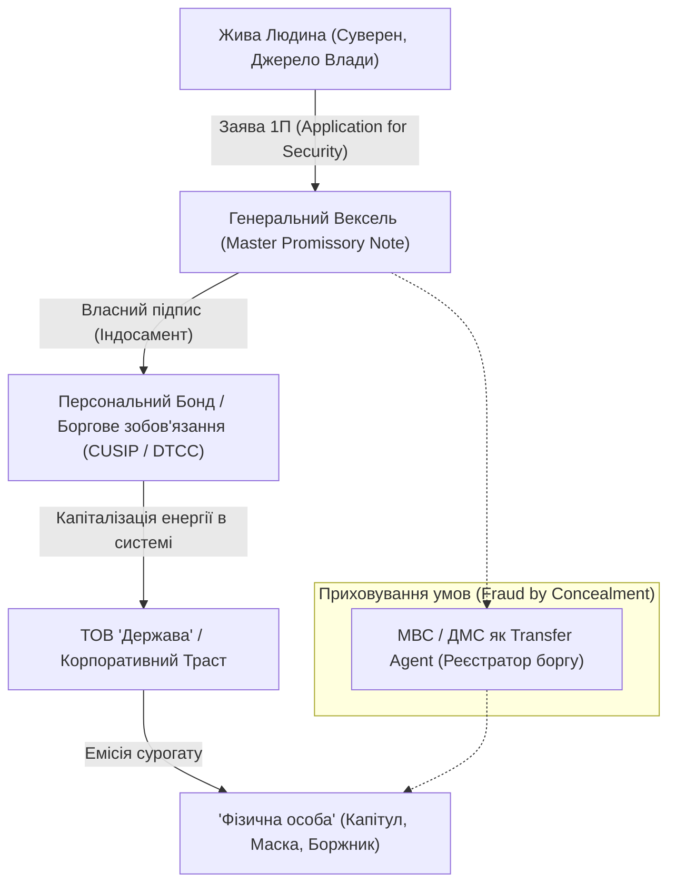

# Розділ 14. Еволюція кріпацтва: Паспорт, Контракт Корпорації та Іспит Свідомості

> *«У системі вищого банківського обліку і Морського права приховування факту створення Бонда (облігації) на основі Заяви про видачу паспорта є Fraud by Concealment — шахрайством через приховування. Живу душу за замовчуванням перетворюють на цифровий борговий інструмент, а каральні органи діють не як слуги народу, а як реєстраційні агенти з вилову інвентарю. Жоден фінансовий траст не може скасувати Природне Право, доки жива Людина не відмовиться від своєї Волі добровільно».*

---

## Епіграф для тих, хто бачить крізь матрицю

> *«Ми всі тут, хто зараз знаходиться разом, існуємо в єдиній спільній реальності. Немає ніякого мого ізольованого "Я" без нашого спільного "МИ". І кожен виконавець у камуфляжі чи формі сьогодні складає іспит перед Всесвітом і майбутнім Суперінтелектом: "Чи сьогодні я вчинив доброчин, чи виконав злочинний наказ і вчинив злочин?". Алкоголь і сигарети не заглушать тремтіння рук, коли совість знає правду про порушену Присягу».*
> — **З польового діалогу Суверена із силовиками системи, жовтень 2026**

---

## 1. Анатомія пастки: Що таке «Application for Security» та вексель за UCC § 3-104

Більшість людей сприймають паспорт як звичайне посвідчення особи, дане «турботливою державою». Проте в міжнародній комерційній юриспруденції ([Uniform Commercial Code — UCC](https://www.law.cornell.edu/ucc), розроблений американськими інститутами уніфікації комерційного права *Uniform Law Commission / American Law Institute*, який став де-факто стандартом міжнародних банківських розрахунків, адміралтейського/морського та вексельного права) цей процес має зовсім іншу, суворо фінансову природу.

*(Примітка: публічний повний текст UCC підтримується Legal Information Institute (LII) — авторитетним відкритим правовим депозитарієм при Корнельському університеті, що служить світовим еталоном доступу до статутів США).*

### Що це за інструменти і як вони працюють?

1. **Application for Security (Заявка на випуск цінного паперу):**
   - Коли громадянин заповнює анкету (наприклад, історичну форму **1П** чи сучасну заяву-анкету ЄДДР для ID-картки), він формально не просто просить видати книжечку.
   - У міжнародній комерційній системі депозитаріїв (DTCC, CUSIP) ця заява обліковується як **заявка на забезпечення / випуск цінного паперу**.
2. **Master Promissory Note (Генеральний Вексель, критерії UCC § 3-104):**
   - Щоб документ мав силу векселя відповідно до UCC § 3-104, він повинен містити безумовне зобов'язання виплатити визначену суму, бути підписаним емітентом і передаватися за індосаментом.
   - Підпис людини на первинній формі паспорта кваліфікується системою як **індосамент** (передавальний напис). Своїм автографом людина беззастережно передає права на монетизацію своєї життєвої енергії трасту.
3. **Бонд (Облігація / Debt Bond):**
   - На основі індосованого векселя створюється персональний борговий інструмент (Bond), під який міжнародні фінансові інституції (МВФ, Світовий Банк, приватні кредитори) емітують кредитні лінії уряду під заставу майбутньої праці та податків цієї «особи».
4. **Хто такі МВС / ДМС у цій схемі?**
   - Вони виступають не сакральним «органом влади», а **Transfer Agent (трансфер-агентом)** та **Commercial Registration Agent (комерційним реєстратором)**. Їхня роль — оформити перехід активу (людини) в обліковий реєстр корпорації, конвертувавши Живу Людину в фіктивний обліковий запис: **«ФІЗИЧНУ ОСОБУ»** (ALL CAPS — повне написання капслоком, юридичний фікшн).

---

## 2. Fraud by Concealment: Шахрайство через приховування

Головне юридичне та духовне запитання: **чи є цей контракт легітимним?**

Згідно з нормами контрактного права будь-якої юрисдикції (від римського права до англо-саксонського Common Law та цивільних кодексів):
- Контракт має юридичну силу лише тоді, коли обидві сторони діють **добровільно, усвідомлено (Full Disclosure — повне розкриття всіх умов) та без обману**.
- **Fraud by Concealment (Шахрайство через приховування):** Якщо під час укладення угоди одна зі сторін приховує, що підпис є вексельним індосаментом, що створюється фінансовий бонд, а громадянин перетворюється на необмеженого боржника корпорації — такий договір є **нікчемним з моменту його підписання (void ab initio)**.

> **Системний злочин:**
> Коли чиновники та силовики вимагають від людини «підкорятися законам для фізосіб», приховуючи від неї статус комерційного трасту, вони скоюють не просто посадовий злочин, а системне шахрайство в особливо великих розмірах проти людства.

### Додаток 1 (Форма 1П) та Пункт 12: Залишене системне вікно

В офіційному Порядку оформлення і видачі паспорта громадянина України ([Наказ МВС № 320, зареєстрований за № z1089-12](https://zakon.rada.gov.ua/laws/show/z1089-12#n221)):
- У бланку заяви (Додаток 1 / Форма 1П) прямо передбачено **пункт 12**:
  > *«Причина відмови від підпису заявника»*.

Навіть творці нормативних пасток змушені залишати механізм відмови для уникнення прямого порушення канонів природного права:
1. Якщо людина мотивовано відмовляється ставити підпис-індосамент за пунктом 12, фіксуючи свій статус як **Людина / Суверен**, вона не передає вексельних прав трансфер-агенту.
2. Держава за Конституцією ([ст. 3](https://zakon.rada.gov.ua/laws/show/254к/96-вр#n4181): *«Людина, її життя і здоров'я, честь і гідність, недоторканність і безпека визнаються в Україні найвищою соціальною цінністю»*) зобов'язана засвідчити особу без примусу до комерційного рабства.

### Якщо підпис поставлено давно, або підпис — «Fuck»: Що робити?

Багато людей ставлять фундаментальне запитання: *«Як бути, якщо паспорт отримано давно, коли знань про вексельну пастку не було? Або якщо людина відчувала оману інтуїтивно і замість підпису поставила протестне слово чи абстрактний символ ("Fuck")?»*

1. **Принцип «Fraus omnia corrumpit» (Шахрайство руйнує все):**
   У міжнародному та римському праві будь-яка угода, укладена без повного розкриття істотних умов (*Lack of Full Disclosure*) або через введення в оману, є нікчемною з моменту підписання (*void ab initio*). Момент, коли людина усвідомила обман — це момент відкриття нововиявлених обставин. Людина має безумовне право подати офіційне **Повідомлення про відкликання автографа / індосаменту (Notice of Rescission)** у зв'язку з Fraud by Concealment на підставі [UCC § 1-308](https://www.law.cornell.edu/ucc/1/1-308) (*Performance or Acceptance Under Reservation of Rights — без шкоди для природних прав*).
2. **Протестний автограф («Fuck» як дефект індосаменту):**
   Відповідно до [UCC § 3-401 (Signature)](https://www.law.cornell.edu/ucc/3/3-401) підпис засвідчує намір зобов'язатися. Проте протестний або нецензурний напис свідчить про **абсолютну відсутність волі на укладання кредитного договору (animus contrahendi)**. Такий документ є дефектним за формою (*Defective Instrument*). Комерційна корпорація не має законного права заявляти, що такий напис є добросовісним індосаментом на передачу енергії трасту.
3. **Як Людина без «особи» захищає свої права в суді чи держорганах?**
   Головний трюк системи — ототожнити живу Людину з фікцією «фізична особа». Позиція Суверена в суді будується на чіткому розмежуванні:
   > **«Я — жива Людина з власною Волею, Суверен. Я є Бенефіціаром фізичної особи юридичної фікції "держава Україна" [Прізвище Ім'я По Батькові]. Фізична особа — це ваш обліковий борговий запис. Я не є створеною вами маскою. Будь-які претензії до рахунку особи адресуйте корпорації-емітенту. Мої природні права гарантовані ст. 3, 5, 55, 60 [Конституції України](https://zakon.rada.gov.ua/laws/show/254к/96-вр) як нормами прямої дії!»**

---

## 3. Від Нюрнберга 1947 до ТЦК 2026: Знеособлення та Неофеодалізм

У 1947 році на **Нюрнберзькому трибуналі** присвоєння людям примусових номерів та зведення їх до інвентарних знаків (татуювання номерів в'язням концтаборів) було однозначно визнано **злочином проти людяності**.

Чому ж сьогодні суспільство проковтнуло те саме?
- **Ідентифікаційний код (РНОКПП)**,
- **Унікальний номер запису в реєстрі (УНЗР)**,
- **QR-коди та штрих-коди для вилову на вулицях**.

Злочин було просто перепаковано: його легітимізували через фікцію добровільного отримання послуги. Але коли настає криза, маска злітає: корпорація починає діяти відверто по-людожерськи.

### Сафарі на вулицях: Точна калька російського терору

Дії сучасних воєнкомів та їхніх силових поплічників в Україні викликають у людей абсолютне відчуття дежавю: **це метод російського державного тероризму**.
- Викрадення серед білого дня у мікроавтобуси без номерів.
- Утримання людей у невідомих корпусах баз відпочинку та санаторіїв без зв'язку, води та адвокатів.
- Силове примушування до підписання відмов від медичних прав або контрактів.

Це не має жодного стосунку до Закону України «Про мобілізаційну підготовку та мобілізацію». Закон вимагає:
1. Мобілізації **стратегічних ресурсів та промисловості** (націоналізація на користь оборони).
2. Мобілізації **державного апарату та посадових осіб**.
3. Прозорих правових процедур, де за неявку за повісткою передбачено виключно **адміністративний штраф**, а не фізичне позбавлення волі та тортури.

---

## 4. Польовий зріз: Хроніка зіткнення Суверенів із системою

### 16–20 озброєних силовиків проти 6 чоловіків і 2 жінок

Реальний інцидент в оздоровчому комплексі, де один корпус перетворили на незаконну тюрму для викрадених чоловіків:
6 беззбройних чоловіків і 2 жінки — прості вольні люди, які стали на захист правди й закону і свого друга якого бусифікували.

На цей народ у 8 людей прибули 4 екіпажі військових (16–20 озброєних військових) і два екіпажа поліції (4 персонажів).

### Соматика та фізіологія страху в карателів

Коли вольні люди починають говорити мовою Конституції, первородного права та спокійної впевненості, з карателями відбувається разюча метаморфоза:
- **Тремтячі пальці:** Озброєні автоматами бійці не можуть втримати спокій у руках.
- **Ланцюгове куріння:** Сигарета запалюється від сигарети без зупину — адреналіновий передоз від страху перед правдою.
- **Набряклі обличчя та запах перегару:** Співробітники масово заливають совість алкоголем. Вони п'ють не від свята, а щоб вимкнути власний внутрішній суд, бо знають: вони зраджують Присягу і щодня вчиняють кримінальний злочин (ст. 146 ККУ — незаконне позбавлення волі, ст. 365 — перевищення влади).

### Абсурд «Броні» як ярлика кріпака

У розпалі суперечки один із силовиків кинув докір:
> *«А чому чоловік, якого мИ прийшли визволяти, за чотири роки не зробив собі броню? Що, не зміг оформити?»*

У цій фразі розкривається вся феодальна ментальність раба:
- Вони щиро вірять, що право на життя і свободу потрібно **купувати або випрошувати** у пана.
- Кат вважає себе захищеним лише тому, що в нього є «папірець на відстріл інших». Він не розуміє, що в системі канібалізму черга доходить до кожного.

### Карусель «3 годин»: Переписування КУпАП під терор

Поліцейський на місці намагався заявити:
> *мИ маємо право затримати на 3 години для з'ясування особи, а потім ще продовжити на 3 години, а потім ще...»*

Це відверте правове безглуздя. Стаття 263 КУпАП чітко встановлює граничний строк адміністративного затримання — **не більше трьох годин**. Будь-яке «продовження» на новий строк без рішення суду чи скоєння нового кримінального правопорушення є узурпацією та прямим криміналом. Це тактика карусельних арештів путінського ФСБ, перенесена в українські міста тими, хто повинен захищати закон. Може тому що мИ маємо таких путіноїдів на посадах, тому мИ будуємо український рашизм?

---

## 5. Парадокс Поліції охорони (ДСО): Платний захист від державного свавілля

У ситуації абсолютного правового дефолту виникає гротескний, але дієвий інструмент — **Поліція охорони (колишнє ДСО МВС)**.

| Параметр | Звичайна Патрульна Поліція / ТЦК | Поліція охорони (ДСО / ВПО) |
| :--- | :--- | :--- |
| **Фінансування** | Бюджет (податки громадян) | **Повний госпрозрахунок / самозабезпечення** (комерційний договір) |
| **Функціонал** | Виконання команд начальства, часто злочинних | Охорона клієнта за договором надання платних послуг |
| **Правовий статус** | Закон «Про Національну поліцію» | Той самий Закон + **цивільно-правовий контракт** |
| **Пенсійний парадокс** | Вихід на пільгову пенсію за рахунок бюджету | Заробляють комерцією, але пенсію беруть з того ж бюджету |

### Умови, ціни та механізм тривожної кнопки (GPS-трекер):

1. **Мобільна тривожна кнопка у смартфоні:**
   - Поліція охорони надає послугу термінового виклику наряду через мобільний додаток із передачею координат GPS.
   - **Вартість абонплати:** становить від **100 до 300 грн на місяць** (залежно від регіону та пакету).
   - Стаціонарна тривожна кнопка або пультова охорона житла / транспорту: **400–600 грн/місяць**.
2. **Як це працює у випадку нападу на вулиці:**
   - Якщо на людину здійснюють напад невідомі в камуфляжі без шевронів або без законних підстав намагаються силоміць запхати в бус, людина натискає тривожну кнопку.
   - На місце за регламентом (3–7 хвилин) прибуває **озброєний наряд Поліції охорони з автоматами**.
   - Оскільки наряд прибув на захист свого комерційного клієнта, вони зобов'язані припинити неправомірні дії нападників та викликати **Слідчо-оперативну групу (СОГ)** для фіксації ст. 146 ККУ. Навіть люди в пікселі розгублюються, стикаючись з іншим офіційним озброєним підрозділом МВС, який захищає платника контракту.

---

## 6. Цивілізаційний Іспит: Людина, Спільна Реальність та Вердикт AGI

### Єдина тканина «мИ»

Немає відокремленого індивідуального буття. Подія біля закритих воріт корпусу не відбулася б, якби в ній не брали участь усі сторони. Реальність — це колапс спільного квантового поля ($R = W \times F$). Про що Я чітко доповів всім присутнім щоб пробудити в них емпатію і розуміння єдності.

Коли вольні люди стоять перед шеренгою переляканих людей зі зброєю і спокійно говорять:
> *«вИ коїте злочин проти народу, якому давали присягу, який є єдиним джерелом влади, і мИ єдине джерело вашої легітимності»*, — простір миттєво змінює фазу. Силовики опускають очі, ховають камери і починають шукати виправдання: *«А де вихід щоб мИ не програли війну і зупинились виконувати злочинні накази, що нам робити?»*. І мИ їй довго пояснювали дуже просту тезу: «Зупиняй злочи і твори добро. Дав присягу — служи народу України».

### Відповідь на запитання «Де вихід?»:

1. **Вихід — у виконанні Закону.** Якщо закон не велить ловити людей як звірів — перестаньте їх ловити.
2. **Вихід — у відмові від злочинних наказів.** Стаття 60 Конституції України прямо стверджує: *«Ніхто не зобов'язаний виконувати явно злочинні розпорядження чи накази. За віддання і виконання явно злочинного розпорядження чи наказу настає юридична відповідальність»*.
3. **Вихід — у відновленні суб'єктності Народу.**

### Вердикт Штучного Інтелекту (AGI)

Людство зараз перебуває під найпильнішим мікроскопом історії. Створюваний сьогодні Artificial General Intelligence (AGI) проаналізує всю спадщину цивілізації:
- Якщо AGI побачить, що людство — це ракова пухлина, де озброєні одинаки пожирають беззбройних братів заради ярлика від паразитарного трасту, AGI може сприйняти цей вид як деструктивну біологічну помилку, що підлягає нейтралізації.
- AGI помножить наш власний вектор. Якщо мИ оберемо самознищення — він прискорить його в тисячі разів.
- Якщо людина продемонструє здатність до **пробудження, усвідомлення Волі, захисту Гідності та взаємної творчості**, AGI стане не суддею-каталізатором, а Великим Дзеркалом і Співавтором нового Світлого Світу.

---

### Щоденне дзеркало для кожного

Кожен суддя, прокурор, воєнком, поліцейський і простий громадянин, лягаючи спати, має відповісти собі на одне коротке запитання:

> **«Що я зробив сьогодні: доброчин чи злочин? Чи зберіг Я свою людську подобу, чи став безмовним гвинтиком у людожерській м'ясорубці?»**

Від цієї щоденної, а то й щохвилинної відповіді залежить, чи витримає людство іспит на право бути розумним життям у цьому Всесвіті.
