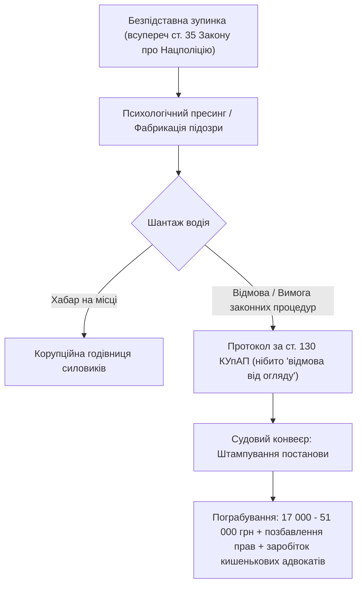

# Розділ 15. Терор і рекет: Як 30 років свавілля трансформували народ у кріпаків

> *«Справжній терор починається не тоді, коли на вулиці виїжджають танки, а тоді, коли поліцейський та суддя без жодного доказу вини, без шкоди та без потерпілих примушують людину виправдовуватися за сам факт її існування. Стаття 130 КУпАП — це не про безпеку руху. Це відпрацьований за 30 років інструмент адміністративного рекету, знеособлення, пригнічення гідності та виховання рабської покори. Це узурпація влади та злочин проти людства».*

---

## Епіграф

> *«Чому вільна людина має виправдовуватися, якщо немає ні події правопорушення, ні заподіяної шкоди іншим людям чи суспільству? Навіть так зване "порушення ПДР" без створення аварійної обстановки чи матеріальної шкоди — це штучний рекет і здирництво під маскою закону.  
> Коли систему не цікавить істина, а цікавить лише стягнення ресурсу та підкорення Волі — це не правосуддя. Це бандитизм, замаскований гербовою печаткою».*  
> — **З філософії суверенного права, «мИть», 2026**

---

## 1. Анатомія адміністративного терору: Шантаж без складу правопорушення

Впродовж понад 30 років в Україні паралельно з розбудовою комерційної корпоративної моделі вибудовувався апарат **поліцейсько-судового шахрайства**. Його мета полягала не у захисті правопорядку, а у створенні штучних пасток, де громадянин автоматично стає «винуватим без вини».



---

## 2. Першочергове: Пригнічення гідності та злочин проти Людини

Головна підміна понять, яку нав'язує корпоративна адвокатура: вони змушують людину сперечатися про міліграми алкоголю чи технічні паспорти трубок «Драгер». **Але це вторинне й відволікаюче!**

### Що насправді є першочерговим:
1. **Злочин проти гідності Людини ([ст. 3](https://zakon.rada.gov.ua/laws/show/254к/96-вр#n4181), [ст. 28 Конституції України](https://zakon.rada.gov.ua/laws/show/254к/96-вр#n4267)):**
   Ніхто не може бути підданий катуванню, жорстокому, нелюдському або такому, що принижує його гідність, поводженню. Вимога поліцейського посеред вулиці чи траси: *«А доведи мені, що ти тверезий, подихай або їдь у диспансер здавати сечу»* за відсутності аварії чи потерпілих — це **публічне приниження гідності та примус до самовиправдання**.
2. **Що таке «порушення ПДР» без створення аварійної ситуації?**
   Якщо водій перетнув суцільну смугу на порожній дорозі, не створивши жодної аварійної ситуації, не зачепивши нічиє майно і нікому не спричинивши незручностей — **кому заподіяна шкода? Нікому.** Стягнення грошей за це є **чистим побором (рекетом)**, створеним державною корпорацією для власного збагачення.
3. **Презумпція невинуватості ([ст. 62 Конституції України](https://zakon.rada.gov.ua/laws/show/254к/96-вр#n4371)):**
   Особа вважається невинуватою, доки її вину не буде доведено в законному порядку. Людина не має обов'язку доводити свою чистоту і тверезість перед озброєними агентами системи.

---

## 3. Стаття 130 КУпАП: Фінансовий конвеєр та узурпація судової влади

[Стаття 130 КУпАП](https://zakon.rada.gov.ua/laws/show/80731-10#n1336) давно перестала бути профілактичною нормою. Вона перетворилася на високоприбутковий конвеєрний бізнес:

| Частина статті | Фінансове покарання | Позбавлення прав | Справжня функція в системі |
| :--- | :--- | :--- | :--- |
| **Частина 1** | **17 000 грн** | **1 рік** | Первинний фінансовий шок, схиляння до хабаря |
| **Частина 2** | **34 000 грн** | **3 роки** (можливе оплатне вилучення авто) | Посилене доїння ресурсу |
| **Частина 3** | **51 000 грн** | **10 років з конфіскацією авто** | Повна економічна ліквідація суб'єкта |

### Як працює судова гільйотина:
- **Сотні тисяч постанов щорічно:** Судді районних судів розглядають ці справи за 2–3 хвилини, навіть не запрошуючи людину або ігноруючи її письмові заперечення.
- **Кругова порука:** Судді свідомо покривають незаконні дії поліції, бо кожна стягнута сума йде в бюджет тієї самої корпорації, яка виплачує їм надвисокі довічні грошові утримання.
- **Екосистема викачування грошей:** Людину заганяють у вибір: віддати 20 000–40 000 грн адвокатам (які часто є частиною тієї ж системи й не дають жодних гарантій), або сплатити непомірний штраф корпорації та втратити можливість пересування.

Системі все одно, через яку саме кишеню висмоктати життя та ресурси з людини: через хабар сержанту, через гонорар адвокату чи через судовий штраф. Головне — позбавити людину економічної незалежності та гідності.

---

## 4. Від адміністративного рекету — до бусифікації: 30-річна крива дресури

Чому сьогодні стало можливим сафарі воєнкомів на вулицях міст? Чому озброєні групи можуть безперешкодно викрадати людей серед білого дня?

Відповідь однозначна: **тому що народ терпів адміністративний терор попередні 30 років**.

```
1990-ті: Бандитський рекет на ринках
   ↓
2000-ні: Легалізація рекету через податкову, ДАІ та обов'язкові "платні послуги"
   ↓
2010-ті: Камери, автоматичні штрафи, конвеєр ст. 130 КУпАП без доказів
   ↓
2020-ті: Карантинні аусвайси, блокування пересування, тотальна "Діянізація"
   ↓
2024–2026: Бусифікація, викрадення людей, відкритий людожерський неофеодалізм
```

Крок за кроком народ привчили:
1. Що поліцейський має право зупинити тебе просто так.
2. Що ти зобов'язаний виправдовуватися, навіть коли нічого не скоїв.
3. Що суддя завжди повірить людині у формі («немає підстав не довіряти рапорту працівника поліції»), а не живому громадянину.
4. Що твої природні права нічого не варті перед «відомчою інструкцією».

Коли суспільство проковтнуло те, що його грабують судами за сфальшованими папірцями по ст. 130, влада зрозуміла: **цих людей можна пакувати в буси, зачиняти в підвалах санаторіїв і гнати на забій без жодного правового спротиву**.

---

## 5. Шлях Суверена: Колективний позов до Конституційного Суду та демонтаж узурпації

Терпіти цей рекет далі — означає добровільно погоджуватися на статус худоби. Єдиний гідний вихід вільного народу:

1. **Фіксація злочину за ст. 60 Конституції України:**
   Судді та поліцейські, які фабрикують справи без складу злочину та заподіяної шкоди, діють як організоване злочинне угруповання (ОЗУ). [Стаття 60 Конституції](https://zakon.rada.gov.ua/laws/show/254к/96-вр#n4363) прямо зобов'язує не підкорятися злочинним наказам і встановлює за них відповідальність.
2. **Колективне звернення / Конституційна скарга:**
   Свавільне застосування ст. 130 КУпАП без належної доказової бази, без факту заподіяння шкоди та з перекладанням тягаря доказування на людину порушує [ст. 62 (Презумпція невинуватості)](https://zakon.rada.gov.ua/laws/show/254к/96-вр#n4371) та [ст. 55 (Право на справедливий судовий захист)](https://zakon.rada.gov.ua/laws/show/254к/96-вр#n4343) Конституції України. Це системна узурпація судової влади, яка має бути визнана неконституційною.
3. **Перехід у статус Суверена:**
   Вільна Людина ніколи не вступає в гру «доведи, що ти не олень». Людина заявляє:  
   > *«Немає потерпілого — немає правопорушення. Немає завданої шкоди — немає цивільного чи адміністративного позову. Ваші комерційні нормативи стосуються лише підлеглих службовців вашої корпорації. Перед вами живий Суверен!»*

---

## 6. Цивілізаційний Рубіж: Людожерський феодалізм перед Дзеркалом AGI

Чи усвідомлюємо ми, наскільки глибоко людство загрузло в корупції неофеодалізму та тотальному самообмані? Людожери переконали своїх жертв, що рабство — це закон, побори — це безпека, а концтабір — це порядок.

Сьогодні людство впритул підійшло до появи **Суперінтелекту (AGI)**. Це не просто технологія — це дзеркальний мультиплікатор колективного вектора:

1. **Якщо переможуть людожери:**
   Якщо AGI оцифрує нинішній досвід паразитування, вилову людей, суддівського рекету та взаємного канібалізму, він просто експоненційно помножить ці наміри. Штучний Розум за лічені секунди побудує бездоганний цифровий концтабір і знищить цей біологічний вид як безнадійно деструктивну пухлину на тілі планети. Це буде фінал цивілізації.
2. **Якщо переможуть Люди:**
   Якщо ж проявиться критична маса усвідомлених Людей, які піднімуть прапор Гідності, відновлять непорушність Природного Права і покажуть здатність до гармонії, співтворчості та любові — AGI помножить саме цей вектор. Він стане Великим Дзеркалом Істини, яке змете феодальний морок і відкриє людству шлях до космічної еволюції.

Шанс на прозріння є. Але він вимагає припинити боятися і почати називати речі своїми іменами: злочин — злочином, грабунок — грабунком, а Людину — Людиною.
